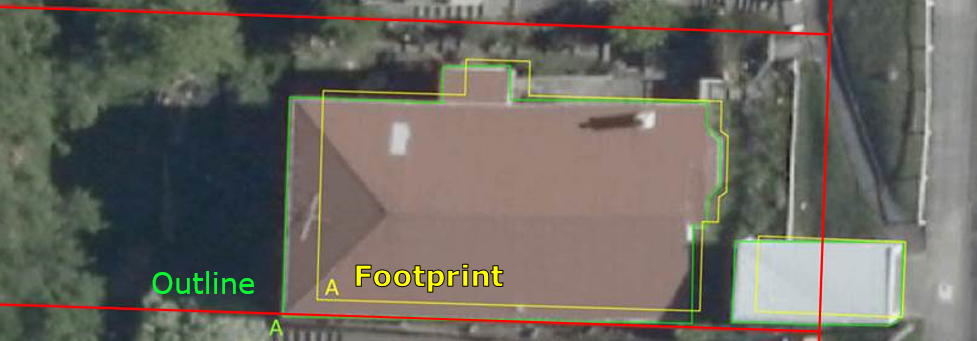

.. _introduction:

Introduction
=============================

Purpose
-----------------------------

This document provides detailed metadata (data dictionary) for the NZ Building Outlines data published on the LINZ Data Service.

Background
----------------------------

Over the next decade, the LINZ Topographic Office is working towards its vision of recognising the way location information can help unlock new patterns and knowledge, particularly when it is combined with other types of information. One of our strategic goals is to improve national scale datasets and maximize their opportunities for reuse by a variety of national and regional stakeholders.

Building outlines have been identified as a dataset of national importance, and influence a multitude of decisions made across New Zealand at both the national and regional levels. It is therefore critical to have a consistent and dynamic dataset available. This building outline dataset will provide a foundation for various stakeholders to map risk modelling, environmental assessment, urban development, resilience planning in addition to the visualization and physical location of buildings. 

Description
---------------------------

This dataset includes the spatial coverage of buildings using remotely sensed information. A building outline is a digital representation of the roof outline of buildings which have been classified from remotely sensed information using a combination of automated and manual processes to extract and orthogonalise building roof outlines and identifies every structure greater than or equal to 10 square meters. These processes use electromagnetic radiation reflectance in the red, green and blue bands (visible bands) to classify pixels based on known patterns of signal combinations from various building roof materials. The building outlines represented in this dataset should not be confused with *building footprints*, which are 2D representations of where a building touches the ground. 

   Image 1. Example of a building outline versus a building footprint.

File format
---------------------------

Aspatial data is provided in UTF-8 format. The source geometry of all spatial tables is NZGD2000 (New Zealand Geodetic Datum 2000).

Definitions
---------------------------

.. table::
   :widths: auto

   ================  ====================================================================================
     Term            Description
   ================  ==============================================================================================
   Aspatial          Data that is not related to a spatial geometry
   LDS               LINZ Data Service
   building          A structure generally permanent in nature which has been constructed to meet a specific objective (e.g. housing, storage, and workplace) and less permanent structures such as caravans and other portable housing may also be represented.
   Building Outlines  Building Outlines are a digital representation of the roof outlines of a buildings which have been classified from remotely sensed information that identifies every building structure that is greater than 10 square meters and falls within an area of the capture of buildings.
   ================  ================================================================================================================

